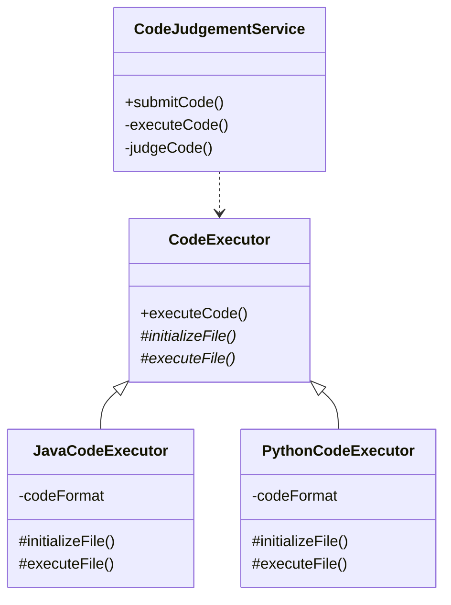

# Judge clone
코드 저지 클론

## 코드 채점 방법

코드 포맷은 아래와 같습니다. main 메서드에 입력되는 코드를 작성하면 됩니다.

### Java

```java
public class RunningProcessApplication {

  public static void main(String[] args) {
    try {
//    code 입력
    } catch (Exception e) {
      System.out.println(e.getClass().getSimpleName());
    }
  }
}
```
### Python

```python
try:
#   code 입력
except Exception as e:
    print(e.__class__.__name__)
```

## 도메인

Challenge
- 챌린지는 식별자와 제목, 설명, 정답을 가진다.
- 제목, 설명, 정답은 `null` 이거나 비어있을 수 없다.

### CodeExecutor 동작


### CodeExecutor
- executeCode()
    - initializeFile()를 실행하고 executeFile()을 실행한다.
    - 명령어의 원자성을 보장할 수 없기 때문에 메서드를 동기화한다.
- initializeFile()
    - 실행할 수 있는 여건을 만든다.
- executeFile()
    - 프로그램을 실행하고 결과를 반환한다.

### Java Code Executor 동작 순서
- initializeFile
    1. 파일을 생성한다.
    2. 코드를 작성한다.
    3. 클래스 파일을 생성한다. 생성하지 못하면 예외가 발생한다.
- executeFile
    1. 클래스 파일을 실행한다.
    2. 결과를 반환한다.
### Python Code Executor 동작 순서
- initializeFile
    1. 파일을 생성한다.
    2. 코드를 작성한다.
- executeFile
    1. 파일을 실행한다.
    2. 결과를 반환한다.
